# SkateArm

**A two-armed robot you can drive from your browser — a 3D simulation today, built to switch to the real [R.Botic Skate](https://www.rboticlabs.com/shop/p/skate-upper-body-v2) when the hardware arrives.**

> **Status — simulation today.** Everything here is sim-validated in MuJoCo; the real Skate is en route, so no real-hardware performance is claimed yet — hardware bring-up is Phase 2.

<div align="center">
  <a href="https://dsl-robotics.github.io/skatearm/"></a>
</div>

<div align="center">

[](LICENSE)
[](sim/)
[](tools/skate_ros2/)
[](sim/)
[](https://github.com/dsl-robotics/skatearm/actions/workflows/tests.yml)

</div>

<div align="center">

**▶ [Drive the twin in your browser — no install needed](https://raw.githack.com/dsl-robotics/skatearm/main/tools/skate_commander/preview.html)**<br>
*Jog the joints live over a recorded scene — the fastest way to feel the cockpit.*

Prefer to read the full story? **[live demo & full write-up](https://dsl-robotics.github.io/skatearm/)**

<sub>Built by a mechatronics student **[open to junior robotics-software roles ↓](#author)**</sub>

</div>

<div align="center">
  <a href="https://dsl-robotics.github.io/skatearm/video/commander_v08_product.mp4">
    
  </a>
</div>

<div align="center">
  
  
  <br>
  <em>Left: <strong>Phase 1 complete</strong> — the autonomous bimanual assembly cycle (GRAFCET sequencer, camera QC).
  Right: <strong>Skate Commander</strong> — mirror-mode bimanual jog, then teach-in: move the arms by hand and the cockpit writes the <code>rbt</code> program itself.</em>
</div>

## Prior real-hardware work — SO-101 bring-up

> **Why this is here:** SkateArm is deliberately sim-first, but sim-to-real isn't foreign ground — on an **earlier project** I'd **already brought up** a real robot on the same ROS 2 / MoveIt / LeRobot stack.

On a real **SO-101 / SO-ARM101 follower-leader arm pair** I ran the whole physical stack on **native Ubuntu 24.04 · ROS 2 Jazzy · MoveIt · ros2_control · LeRobot**: follower-leader teleop, multi-camera capture, dataset record / replay, and an **ACT policy trained and run online on the physical arm** — then drove the real controllers end-to-end through MoveIt, verifying joint-by-joint that all six commanded channels moved the actual arm.

<div align="center">
  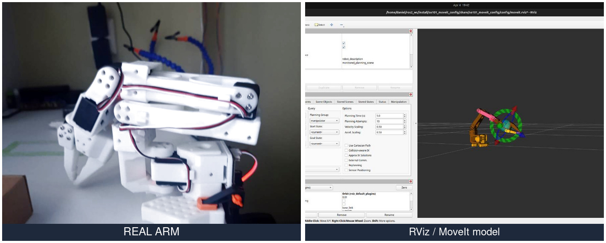
  <br>
  <sub><b>Real arm ↔ RViz / MoveIt model.</b> The honest lesson from real hardware: a green MoveIt state does <b>not</b> mean the arm is calibrated or safe to move — real-pose ↔ model reconciliation was the hard part — exactly the sim-to-real gap SkateArm is built to close.</sub>
</div>

**→ [SO-101 · real-hardware ROS 2 + MoveIt bring-up](https://github.com/Lavs-Daniels-Skots-231RMC173/so101-native-ubuntu-ros2-moveit)** — the full engineering log: bring-up, controller validation, and the calibration / state-mismatch debugging lessons.

## What are you here for?

| You want to… | Go to |
|---|---|
| Drive the robot (twin or real) from a browser | [Skate Commander](#skate-commander--web-cockpit) |
| Connect a ROS 2 / MoveIt 2 stack to a Skate | [skate_ros2](#skate_ros2--the-wire) |
| See the autonomous assembly cell | [Work-cell](#autonomous-work-cell-phase-1--complete) |
| Get the control-ready model & collision layer | [Sim foundations](#sim-foundations-phase-0) |
| Run it yourself | [Quick start](#quick-start-simulation) |

<details>
<summary><strong>New to the jargon?</strong> — a 20-second glossary &nbsp; <kbd>click to expand</kbd></summary>

- **MuJoCo** — a physics simulator; the robot "lives" here virtually before any real hardware exists.
- **ROS 2** — the standard open-source middleware (the robot's "operating system").
- **URDF** — the file describing the robot's links, joints and limits.
- **FK / IK** — forward kinematics ("where the hand is for these joint angles") / inverse kinematics ("which joint angles put the hand there").
- **TCP** — tool center point: the exact tip of the tool the robot controls.
- **Jog** — nudging a joint or the tool one small step at a time (hold a button or drag a slider).
- **Digital twin** — a 3D copy of the real robot, driven by the same commands.
- **Deadman / E-STOP** — safety: motion stops if the connection goes silent or you hit emergency-stop.

</details>

## Skate Commander — web cockpit

<div align="center">
  
</div>

> **Early access · under active development** — v0.8.5 is sim-first; drive the twin in your browser now, real-Skate support lands with the hardware.

A browser cockpit for the Skate: a 3D digital twin built from the official URDF, driven over the **same UDP wire** the real robot speaks. Starts E-stopped, arms at the robot's measured pose, deadman drops in 0.3 s if the tab closes.

<div align="center">
  
  
  
  
  <br>
  <em><b>Manipulability cloud</b> · <b>live telemetry plots</b> (30 Hz) · the <b>workstation shell</b> (menu bar, tool rail, Stage / Property dock) · <b>ghost-preview</b> Approve / Cancel gate</em>
</div>

### Open-source integrations

<p align="center">
  <a href="https://github.com/kevinzakka/mink"></a>
  <a href="https://rerun.io"></a>
  <a href="https://huggingface.co/docs/lerobot"></a>
  
</p>

Skate Commander integrates best-in-class open-source robotics tools — each **opt-in**, **permissively licensed** (so it can actually ship), and **validated in the sim** before it lands. Every one falls back cleanly: a missing optional dependency never disturbs the numpy drag-IK, the browser twin, or the cockpit tick loop.

| Integration | What it is | Role in the cockpit | Licence | Enable |
|---|---|---|---|---|
| **[mink](https://github.com/kevinzakka/mink)** | MuJoCo differential-IK QP solver | Self-collision-avoiding drag-IK backend — keeps a safe standoff from torso / legs / other arm as a hard constraint (**+14 mm** vs −90 mm penetration) | `Apache-2.0` | `--ik mink` |
| **[rerun.io](https://rerun.io)** | Multimodal 3D + time-series viewer | Scrub-able telemetry beside the twin — the **meshed robot** in 3D plus per-arm joint / IK / manipulability plots | `Apache-2.0 / MIT` | `--rerun` |
| **[LeRobot](https://huggingface.co/docs/lerobot)** | Hugging Face robot-learning stack & dataset standard | Export teach-in / teleop demos as a **LeRobotDataset v3.0** → train ACT / Diffusion Policy / π0 | `Apache-2.0` | `⤓ LeRobot` |

<div align="center">
  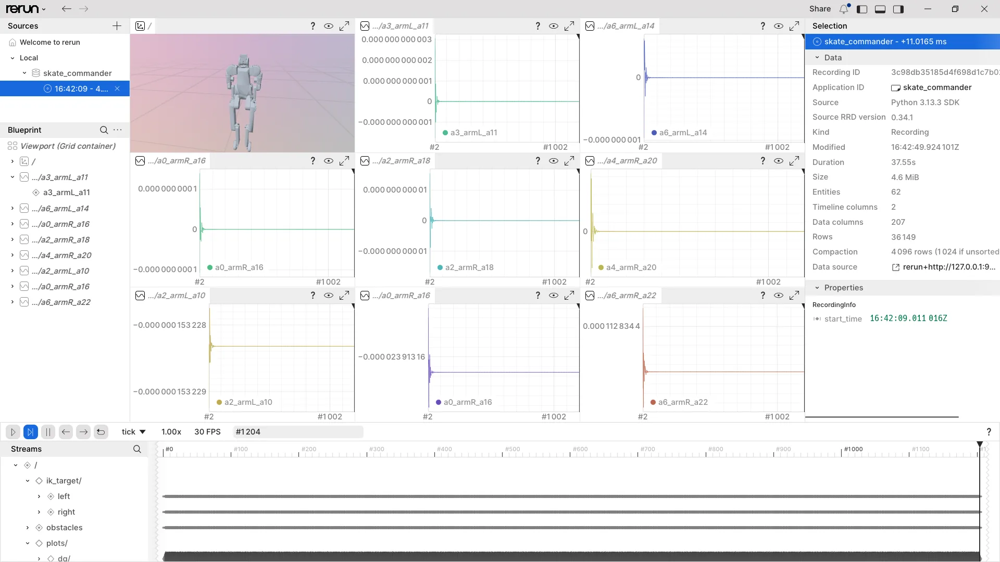
  <br>
  <sub><b>rerun.io</b> integration — the meshed twin + scrub-able telemetry, live beside the browser cockpit</sub>
</div>

<sub>Each lands behind a flag or a button and is documented in the [roadmap](docs/ROADMAP.md); more integrations are on the way.</sub>

<a id="act-pipeline"></a>
## Deep-dive · From cockpit to policy — an ACT visuomotor imitation-learning pipeline

> The LeRobot integration taken end-to-end: a **scripted DLS-IK expert** produces bimanual-reach
> demos, exported as a **LeRobotDataset v3.0**; an **ACT** policy is then **behaviour-cloned** from
> them on a single 4 GB laptop GPU and rolled out **closed-loop** in the same MuJoCo twin. At
> inference it sees only pixels + joint angles — never the target coordinates — so it reaches
> purely from vision. An imitation-learning *pipeline* run end-to-end on a laptop, not a claim
> that reaching was discovered from scratch.

<div align="center">
  
  &nbsp;&nbsp;
  <picture>
    <source media="(prefers-color-scheme: dark)" srcset="docs/img/act/accuracy_dark.png">
    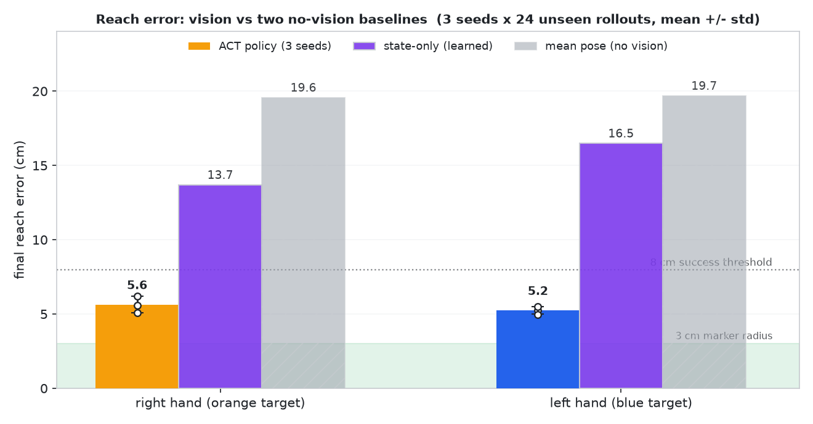
  </picture>
  <br>
  <sub><b>Left</b> — the trained policy driving both arms to the targets from a single camera. <b>Right</b> — reach error vs two no-vision baselines (a learned state-only policy and a fixed mean pose); only vision clears the 8 cm success line.</sub>
</div>

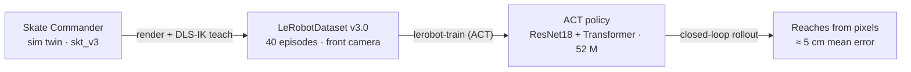

### 1 · Dataset — bimanual reach from a front camera

<div align="center">
  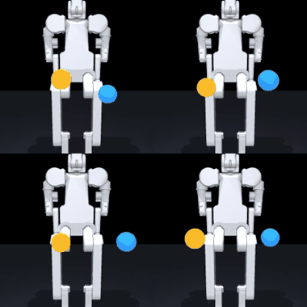
  &nbsp;
  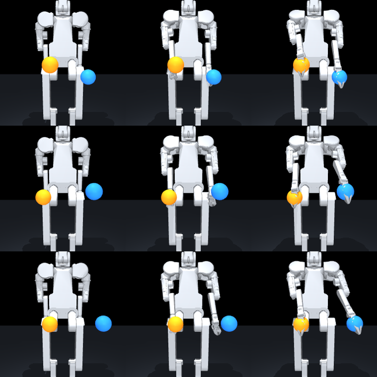
</div>

<details>
<summary><strong>Dataset spec</strong> — fields, sizes, task string</summary>

| Field | Value |
|---|---|
| Format | **LeRobotDataset v3.0** (mp4 video + parquet) |
| Episodes / frames | **40 / 1 880** @ 30 fps |
| Camera | fixed **front** view, 256×256, neutral-gray robot |
| Targets | **orange** (right hand) + **blue** (left hand) floating handles, randomized in the reachable workspace |
| `observation.images.front` | RGB video, 256×256 |
| `observation.state` / `action` | 14-DoF arm pose (rad) / next commanded pose (ALOHA convention) |
| Task string | `reach the orange (right hand) and blue (left hand) targets` |
| On disk | ≈ 5 MB |

</details>

Every episode both hands glide from the home pose to two random targets via
damped-least-squares IK — a straight Cartesian line with a smootherstep speed profile.
**Rejection sampling** keeps only target pairs both hands can reach (< 1.2 cm residual), so
every demonstration lands cleanly on its marker. Written with the real `lerobot` writer, so
it loads with `LeRobotDataset(...)` anywhere.

### 2 · Training — ACT on a laptop RTX 3050

<div align="center">
  <picture>
    <source media="(prefers-color-scheme: dark)" srcset="docs/img/act/loss_curve_dark.png">
    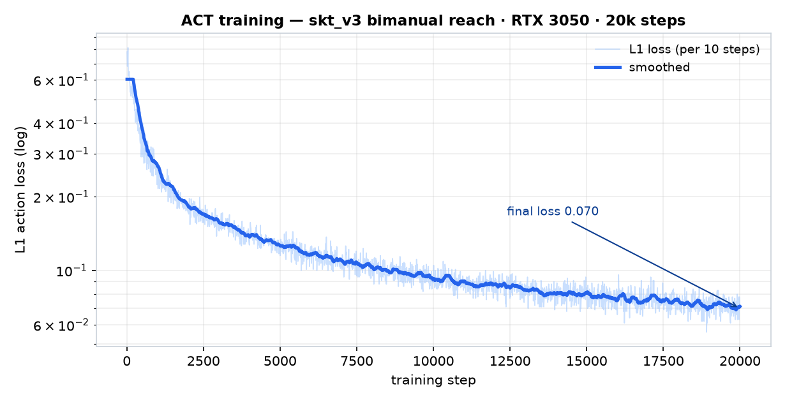
  </picture>
</div>

<details>
<summary><strong>Training config</strong> — model, hardware, hyperparameters</summary>

| Setting | Value |
|---|---|
| Policy | **ACT** — ResNet18 vision backbone + Transformer, deterministic (no VAE) |
| Trainable params | **52 M** |
| Hardware | **NVIDIA RTX 3050 Laptop · 4 GB** via WSL2 CUDA passthrough |
| Batch · steps | 4 · **20 000** |
| Wall-clock | **≈ 32 min** (~10 steps/s) |
| Peak VRAM | **0.62 GB** |
| Final L1 loss | **0.070** |
| Image norm | ImageNet stats via the LeRobot processor pipeline |

</details>

Chunked action prediction (`chunk_size = 32`), ImageNet-pretrained backbone, and
`use_vae = false` — a deterministic policy is the right fit for a deterministic reach and
removes the VAE train/inference gap on a small dataset. The whole run sits comfortably under
**1 GB** of VRAM.

### 3 · Rollout — reaching from pixels

<div align="center">
  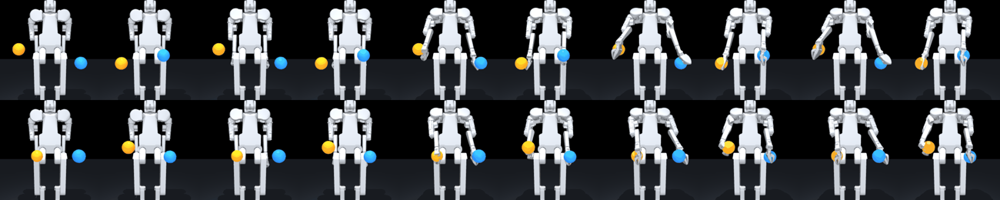
  <br>
  <sub>Home → reach, four episodes. The policy sees only the camera frame + joint angles.</sub>
</div>

| Reach eval — 24 unseen rollouts · identical targets | ACT (vision) | State-only (learned, no camera) | Mean pose (no learning) |
|---|---|---|---|
| Mean reach error — right hand | **5.6 ± 0.6 cm** | 13.7 cm | 19.6 cm |
| Mean reach error — left hand | **5.2 ± 0.3 cm** | 16.5 cm | 19.7 cm |
| Both hands within 8 cm | **69 % ± 9 %** | 0 % | 0 % |
| Median worst hand (pooled) | **6.9 cm** | 17.4 cm | — |
| Target marker diameter | 12 cm | — | — |

Closed loop: each step the policy receives the current camera frame + 14-DoF joint state and
predicts the next pose; the sim applies it **kinematically** (forward kinematics — the loop is
closed on vision, not on actuator dynamics or contact), re-renders, and feeds it back. The arms
converge on targets whose coordinates the policy is never given — a pure visuomotor imitation of
the reach *mapping*. Evaluation
is **in-distribution** (same twin and target distribution as training, on held-out target draws),
so it validates the learned vision→motion mapping — not sim-to-real transfer, which is Phase 2.

<sub>ACT numbers span **3 independent training seeds** (24 held-out rollouts each; the chart's error bars are the seed-to-seed spread). Two **no-vision controls** on the same targets bracket it: a fixed **mean pose** and a **learned state-only** policy — a small MLP mapping joint state → next commanded pose, trained on the same demos with no camera. The learned control settles near the workspace centroid, so it beats the fixed pose (**13.7 / 16.5 cm** vs 19.6 / 19.7 cm) — but with no target signal it still never lands (**0 % success**). Vision is what turns ~15 cm into ~5 cm.</sub>

**Does it hold *outside* the training box? No — and here's the honest measurement.**
Re-running the **same checkpoint** on targets shifted beyond the training reach
volume (further forward and out) — but all still IK-reachable to **<2 cm** — the
reach collapses:

| Same checkpoint · 24 rollouts | In-distribution | Out-of-distribution |
|---|---|---|
| Reach error — right / left | **5.6 / 5.2 cm** | 16.8 / 12.9 cm |
| Both hands within 8 cm | **67 %** | **0 %** |
| Targets IK-reachable < 2 cm | 100 % | 100 % |

Every out-of-distribution target was physically reachable (mean IK residual 7 mm),
so this is a real generalization gap, not an artifact: the learned vision→motion
map **interpolates inside its training reach volume and does not extrapolate past
it**. [`ood_reach.py`](tools/skate_commander/examples/act_reach/ood_reach.py)
(`MODE=indist|ood`) reproduces both columns from the one checkpoint; raw numbers
in [`eval_data/ood.json`](tools/skate_commander/examples/act_reach/eval_data/ood.json).

**Does it tolerate a shifted camera and lighting? Mostly — and it fails gracefully.**
Re-running the **same checkpoint** on the same targets under **domain randomization** —
camera extrinsics jittered (±12° / ±8%), plus lighting and robot/floor appearance, task
cues (orange/blue targets) kept fixed:

<div align="center">
  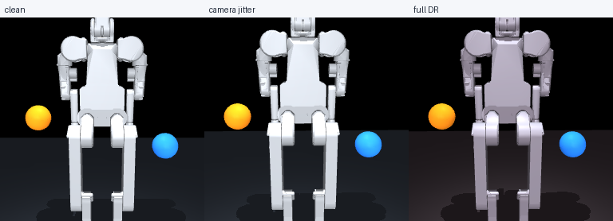
  <br><sub>The three render conditions (episode 0): <b>clean</b> · <b>camera jitter</b> · <b>full DR</b>.</sub>
</div>

| Same checkpoint · 24 targets | clean | camera jitter | full DR |
|---|---|---|---|
| Reach error — right / left | 5.7 / 5.0 cm | 7.2 / 7.4 cm | 7.3 / 7.4 cm |
| Both hands within 8 cm | 71 % | 38 % | 42 % |

The reach **degrades gracefully — it doesn't collapse** (≈ 7 cm, not the ~16 cm OOD failure):
a mis-calibrated camera raises the error ~40 % and roughly halves success, but the arms still
localize. Full DR ≈ camera-only, so the sensitivity is **dominated by camera geometry, not
lighting/appearance** — a useful sim-to-real signal. [`robust_reach.py`](tools/skate_commander/examples/act_reach/robust_reach.py) (`clean|cam|dr`)
reproduces it; raw numbers in [`eval_data/robust.json`](tools/skate_commander/examples/act_reach/eval_data/robust.json).

**Does the reach survive real actuator dynamics? Yes.** The rollout above is
kinematic — each predicted pose is written straight to the joints. Re-running the
**same checkpoint** but *commanding* every pose through the model's torque-limited
position servos and integrating full rigid-body dynamics under gravity
(`mj_step`), the reach holds:

| Same checkpoint · 24 rollouts | Kinematic (teleport) | Dynamic (servos + mj_step) |
|---|---|---|
| Reach error — right / left | 5.6 / 5.2 cm | 5.2 / 4.6 cm |
| Both hands within 8 cm | 67 % | 88 % |
| Unstable / diverged | — | 0 / 24 |

<div align="center">
  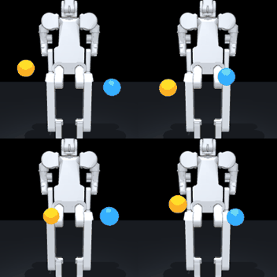
  <br>
  <sub>Same policy, driven through the position servos under gravity (<code>mj_step</code>) rather than teleported — four episodes.</sub>
</div>

The servos track each command to **~2° (0.034 rad)** and every episode stays stable, so
the kinematic number wasn't hiding a dynamics cliff — the commanded poses are physically
realizable. (The kinematic column is the single published checkpoint on these targets — 67%, just under the 3-seed 69% ± 9% headline; the small dynamic edge is servo settling smoothing the motion plus 24-rollout noise, not a real gain.) [`dynamic_reach.py`](tools/skate_commander/examples/act_reach/dynamic_reach.py)
reproduces it; raw numbers in [`eval_data/dynamic.json`](tools/skate_commander/examples/act_reach/eval_data/dynamic.json).
Contacts are disabled in the control scene (the raw meshes self-jam at the shoulders), so
this adds gravity, inertia and torque limits — not self-collision.

> **How this was actually debugged:** the policy trained to 0.070 loss but first rolled out **0.65 m — worse than home**. The culprit was a silent normalization-contract bug, not the weights. Full story → **[The ACT policy that reached for garbage](docs/deep-dive-act-normalization.md)**.

### Reproduce

Full scripts: [`tools/skate_commander/examples/act_reach/`](tools/skate_commander/examples/act_reach/) — run from that directory.

```bash
# 1 · generate the dataset from the MuJoCo twin (osmesa offscreen render)
MUJOCO_GL=osmesa python gen_reach_dataset.py 40 256

# 2 · train ACT on the RTX 3050 (~32 min)
lerobot-train \
  --dataset.repo_id=skate/reach_act \
  --dataset.root=../../lerobot_datasets/reach_act \
  --policy.type=act --policy.use_vae=false --policy.device=cuda \
  --batch_size=4 --steps=20000 --save_freq=5000 \
  --output_dir=../../act_reach

# 3 · roll the trained policy out closed-loop in the twin
MUJOCO_GL=osmesa python rollout_act.py ../../act_reach/checkpoints/020000/pretrained_model 6
```

**Artifacts & eval harness.** The eval that produces the numbers above is in-repo, not just a claim: [`baseline_reach.py`](tools/skate_commander/examples/act_reach/baseline_reach.py) (the mean-pose baseline), [`state_baseline_reach.py`](tools/skate_commander/examples/act_reach/state_baseline_reach.py) (the learned state-only baseline) and [`aggregate_reach.py`](tools/skate_commander/examples/act_reach/aggregate_reach.py) rebuild the mean ± std table and the chart from the per-seed rollouts, and the raw [`eval_data/`](tools/skate_commander/examples/act_reach/eval_data/) (3 seeds + baseline JSONs) is committed — so the headline is one command to check. The **40-episode dataset** and **trained checkpoint** (with normalization processors) are also published as release [**⤓ act-reach-v1**](https://github.com/dsl-robotics/skatearm/releases/tag/act-reach-v1). The one non-redistributable piece is the **`skt_v3` model** ([Rbotic/skate_teleop](https://github.com/Rbotic/skate_teleop)), fetched by `sim/make.py --clone`.

<details>
<summary><strong>Notes &amp; gotchas</strong> — the non-obvious bits &nbsp; <kbd>click to expand</kbd></summary>

<br>

- **Reach toward the robot's real front (+Y).** The arm workspace opens up fully only in
  front of the chest; reaching behind is cramped and self-occluded. The fixed camera looks at
  the true front, so both handles always sit *between* camera and torso and stay visible.
- **Normalization lives in the processors, not the policy.** In `lerobot` 0.6.0 the ACT model
  has no built-in normalize / unnormalize — inference must be wrapped with
  `make_pre_post_processors(...)`: `preprocessor(obs) → select_action → postprocessor(action)`.
  Skip it and the policy silently receives un-normalized inputs and drives the arms to garbage.
- **VAE off for small data.** With only 40 demos the VAE's latent-conditioned decoder behaves
  poorly at inference (latent = 0); a deterministic policy trains cleaner and reaches far
  better.
- **4 GB is enough.** Batch 4 holds peak VRAM at 0.62 GB; `PYTORCH_CUDA_ALLOC_CONF=expandable_segments:True`
  avoids fragmentation stalls on the laptop GPU.

</details>

---

**The cockpit is a full teleoperation workstation** — drag-IK and mirror-mode bimanual motion, RRT-Connect collision-routing, Python + teach-in programs, a Stage / Property shell, live telemetry plots, a TF tree, diagnostics, and scene markers with keep-out obstacles. The full catalogue:

<details>
<summary><strong>Full cockpit feature catalogue</strong> — motion · programs · vision · safety · observability · scene tools &nbsp; <kbd>click to expand</kbd></summary>

### Motion, IK &amp; manipulability

| Feature | What it does |
|---|---|
| Jog + sliders | Hold −/+, drag the thumb, or jump straight to a limit; amber = your command, azure = actual position |
| Cartesian jog | Step the TCP along world X/Y/Z in mm — server-side IK, auto-stops on arrival |
| Drag-IK (3- or 6-DoF) | Grab a wrist sphere in 3D — server-side DLS IK (damped least squares inverse kinematics) glides all 7 arm joints. The tool rail's **rotate** mode adds wrist **orientation** for a full 6-DoF pose target (position is held while the wrist reorients) |
| Singularity awareness | Live manipulability readout; a **SING** chip warns near a wrist singularity, where a small cartesian move would need huge joint speeds |
| Manipulability map | A **DEX** toggle renders a coloured point cloud of the arm's reachable workspace — warm where the arm is dexterous, blue near its singular reach limits |
| Mirror mode | Bimanual: jog/slider/IK on one arm is reflected onto the other — the sign map is *measured* from the model's FK, not guessed |
| Dual-arm carry | **CARRY** — both wrists hold one object and move together via an X/Y/Z pad, preserving their separation (a true two-handed carry) |
| Jerk-limited motion | Jog, replay and **Home** use acceleration-limited / trapezoidal profiles — motion eases in and out instead of snapping (E-STOP still stops instantly) |

### Programs &amp; teaching

| Feature | What it does |
|---|---|
| Python programs | Built-in editor + `rbt` API (`movej`/`pose`/`movel`/`home`/waypoints); **Click-to-Step** runs one motion at a time; E-STOP or any manual input kills the program |
| Control flow | A **+ FLOW** snippet bar inserts indent-aware `repeat` / `while` / `if` / `wait` skeletons, with `rbt.ok()` / `blocked()` / `contact()` / `near()` condition helpers — loops and conditionals run on the same guarded bridge |
| Natural-language programs | Describe a task in plain English — a safe **offline** parser writes the `rbt` program into the editor (AST-validated; optional LLM fallback), which you then Click-to-Step through the same guarded bridge |
| Teach-in recording | Press **● REC**, move the robot by hand — every settled pose becomes a line of `rbt` code, ready to replay |
| Waypoint sequencer | Record poses, play with pause/loop, save/load named sequences |

### Tools &amp; traces

| Feature | What it does |
|---|---|
| Tool / TCP offsets | Named end-of-arm tools (mm offsets); FK, IK, traces and the gizmo all follow the active TCP |
| TCP traces | Colored tool-center-point trajectories drawn in the viewport |

### Vision &amp; autonomy — validated in simulation, returning with the depth camera

> These camera-derived tools were built and validated against the MuJoCo render, then **parked behind a "Camera tools — under development" stub** in v0.8.0 — the live camera must be a *real* connected depth sensor, not a rendered one, so they re-enable when the hardware arrives (the vision backend stays in the tree as reference). The sim numbers below are real: they are sim-validated, not live cockpit toggles today.

| Capability (sim-validated) | What it does |
|---|---|
| On-board camera | A camera view rendered from the model (MuJoCo) and streamed into the cockpit (MJPEG), switchable between viewpoints |
| Work-camera point cloud | A **PCL** toggle back-projects the work camera's depth into the twin — a coloured 3D point cloud of what it sees (table, target), the input the grasp planner consumes |
| Vision-guided pick | **DETECT** finds the workspace target and back-projects its centroid to a world pose (~2 mm vs ground truth); **PICK** drives the right arm to it through the same IK + collision guard and closes the gripper |
| Smart pick (multi-object) | A **GRASP** toggle synthesises a top-down parallel-jaw grasp on the point cloud for **every** object (RANSAC removes the table, clusters the rest, fits a grasp — centre, *measured* height, footprint, yaw, width check — to each object's own geometry, rejecting the robot's own limbs). A pluggable detector labels each by **colour + shape** (opt-in YOLO backend for real objects); an object selector + **SMART** pick the chosen one by name through the IK + guard |
| Closed-loop visual servoing | **SERVO** locks the gripper onto the target *in image space* as it descends — robust to camera-calibration error (open-loop misses ~43 mm, IBVS ~5 mm in sim) |

### Safety &amp; modes

| Feature | What it does |
|---|---|
| Collision guard | Every target checked for self-collision *before* it is sent — including along interpolated paths; capsule / box collision model |
| Contact reflex | A torque spike on a *stalled* arm joint (loaded but not moving — i.e. pushing into something) latches a soft-stop; clear it from the **CONTACT** chip |
| Planned routing | When a straight move (**Home** or a **waypoint** goto/play) would clip a self-collision, an **RRT-Connect** planner (bidirectional RRT) routes the arms *around* it (collision-free) instead of stalling — the legs / balance chain are left untouched |
| SIM / REAL toggle | Same protocol either way; switching always re-latches the E-STOP |

### Observability &amp; operator tools

| Feature | What it does |
|---|---|
| Live telemetry plots | Foxglove-style scrolling strip charts (joint angle / velocity / temperature / TCP / link RTT) at 30 Hz — colour-coded legend, click-to-toggle lines, pause, current-value markers |
| Live TF frame tree | RViz2-style transform tree (world ▸ base_link ▸ arm flanges) with world-mm readouts and eye-toggled RGB axis triads that track the kinematics |
| Diagnostics panel | RViz `robot_monitor`-style status tree (system link, E-STOP, overtemp, guard, contact, RTT + per-joint temp / vel / load) with OK / warn / error dots and a worst-status badge |
| Joint-limit meters | Each joint's slider edge and value tint amber near a limit (red at the hard stop), with an amber bounding box on the link in 3D |
| Collision-mesh display | A collision-mesh toggle (key **B**) renders the guard's actual capsule / box model in 3D and reddens any contacting pair — see exactly what the guard sees |
| TCP-force overlay | A TCP-force toggle (key **F**) draws a per-arm end-effector force arrow estimated from the joint torques (`(J·Jᵀ)⁻¹·J·τ`), low-pass filtered, amber when straining (> 12 N) |
| Trajectory replay + scrub | A 45 s rolling record of joint motion with a scrubber and Play — drag to freeze the twin at any past instant; an amber playhead tracks it on the strip charts |
| CSV export | One-click **↓ CSV** of the current plot signal or the full 26-DoF recorded trajectory (degrees, real timestamps) |
| Global speed override | A **SPD** slider scales all motion server-side — jog and every glide (home, sequences, RRT routes) |
| Sim transport &amp; inspection | Play / Pause / Step / Reset of the autonomous motion with a run clock; a two-point **measure** tool; a viewport **stats HUD** (FPS / draw-calls / triangles); **Stage search** + a 3D selection outline |
| External telemetry (rerun.io) | Optional **`--rerun`** streams the live twin into a [rerun](https://rerun.io) viewer — the full **meshed robot** in 3D beside scrub-able joint / drag-IK / manipulability time-series; opt-in, off by default |

### Scene, markers &amp; planning

| Feature | What it does |
|---|---|
| Stage hierarchy &amp; inspector | An Isaac-Sim-style **STAGE** tree (World ▸ Skate ▸ arms ▸ joints + overlays / grid) with visibility eyes; click any node for a live **PROPERTY** inspector (name, type, world pose) |
| Viewport display settings | A gear popover toggles grid / axes, sets camera FOV, swaps the background, and flips render quality |
| Scene markers | Spawn a target in reachable space and drag its X/Y/Z gizmo; each marker shows live **reachability** (green / red), one-click **→L / →R** go-to (server-side IK), **→P** to append `rbt.moveto(…)` to a program, and **⇄ both** for a simultaneous **bimanual reach** |
| Virtual obstacles | Spawn keep-out boxes and place them freely with a 3D gizmo, sized to any W×D×H — the RRT-Connect planner and the collision guard route the arms *around* them |
| Planning preview | Before a **Home** or **waypoint** move, a translucent **ghost robot** shows the destination pose and a blue trail shows the planned collision-free **route**, gated behind **Approve / Cancel** |
| Save / load scene | Save the placed markers + obstacles to a JSON scene file and reload them later |

</details>

<div align="center">
  
  <br>
  <em><strong>v0.8.5 cockpit</strong> — an Isaac-Sim-style workstation: a menu bar, a left tool rail, the 3D MuJoCo twin, a STAGE / PROPERTY dock and live telemetry plots. Mirror mode, dual-arm carry, jerk-limited motion and teach-in all live here. <strong><a href="https://raw.githack.com/dsl-robotics/skatearm/main/tools/skate_commander/preview.html">▶ Live preview</a></strong> (drive the joints — no install) · full docs: <a href="tools/skate_commander/">tools/skate_commander/</a></em>
</div>

## skate_ros2 — the wire

A ROS 2 driver over Skate's **native UDP protocol** (documented packet layout, deadman semantics, 26-DoF ordering) plus a **MuJoCo sim endpoint speaking the same protocol** — develop your stack before the robot arrives, then swap `127.0.0.1` for `r.local`. Safety mirrors the firmware: arm-at-measured-pose, command-freshness deadman, 58 °C overtemp latch. The wire &amp; safety logic is unit-tested without ROS; end-to-end verified over real sockets. **On top of the wire sits a MoveIt 2 planning stack** (below).

<div align="center">
  
  <br>
  <em>A scripted client drives the MuJoCo endpoint over <strong>real UDP packets</strong>. At t = 11 s it goes silent — the watchdog dampens the robot.
  HD video: <a href="docs/video/ros2_wire_demo.mp4">ros2_wire_demo.mp4</a></em>
</div>

| On the wire (sim endpoint) | Result |
|---|---|
| Command rate | 60 Hz sustained (configured target) |
| Telemetry | ~190 packets/s |
| Tracking error | 0.015 rad (vs the MuJoCo model) |
| Watchdog dampen after silence | < 0.3 s (configured timeout) |

*These are sim-endpoint figures: command rate and watchdog timeout are configured targets confirmed in simulation, and tracking error is against the MuJoCo model. Real-hardware numbers come once the Skate arrives.*

### MoveIt 2 motion planning

On top of the wire, [`skate_moveit_config`](tools/skate_moveit_config/) adds **MoveIt 2** planning for the two arms — `left_arm` / `right_arm` / `both_arms` groups, an SRDF generated from the URDF, OMPL. **Built &amp; end-to-end-verified on ROS 2 Jazzy:** `move_group` loads the config, **MoveItPy plans collision-free bimanual trajectories**, and the **full loop executes with the sim arm moving to the planned pose**. A `FollowJointTrajectory` bridge streams the plan to the driver, so MoveIt inherits the same deadman / e-stop / overtemp safety instead of re-implementing it:

```
MoveIt 2 (skate_moveit_config)  →  FollowJointTrajectory bridge  →  skate_driver  →  UDP  →  MuJoCo sim / real Skate
```

<div align="center">
  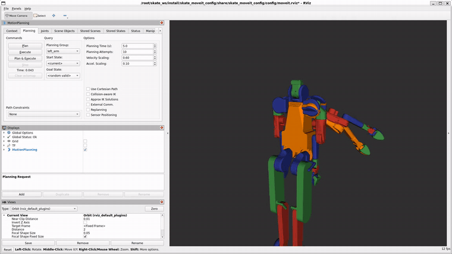
  <br>
  <em>RViz <strong>MotionPlanning</strong> on this stack — set a goal, <strong>Plan</strong>, <strong>Execute</strong>; the Skate arm drives to it live over the UDP bridge. (<a href="docs/video/rviz_moveit.mp4">HD clip</a>)</em>
</div>

Prefer the standard controller stack? [`skate_ros2_control`](tools/skate_ros2_control/) provides a **C++ ros2_control `SystemInterface`** plus per-arm `JointTrajectoryController`s under the same controller names — MoveIt executes through `controller_manager` with zero config changes (verified end-to-end on Jazzy, no Python bridge in the loop).

The cockpit can attach to the **same** sim endpoint as a pure observer — toggle **OBSERVE** and a MoveIt execution renders live in the browser twin, with an **EXTERNAL** chip while it moves ([details](tools/skate_commander/)).

Full docs + a **Windows/WSL2 setup guide** are in [`tools/skate_ros2/`](tools/skate_ros2/) and [`tools/skate_moveit_config/`](tools/skate_moveit_config/).

<div align="center">
  
  <br>
  <em>Rates & tracking from the demo run · full docs: <a href="tools/skate_ros2/">tools/skate_ros2/</a></em>
</div>

## Autonomous work-cell (Phase 1 — complete)

The demonstrator task, end to end in simulation: the left arm fixtures a base part in the air, the right arm aligns a peg by relative servoing and inserts it with a **torque-guarded** descent — a joint-torque (τ) watchdog in the sim, not a wrist force/torque sensor. A GRAFCET sequencer (the IEC step-sequencer standard used in industrial soft-PLCs) runs the full cycle on sensor-based transitions — no timers — and two fixed cameras with classical CV deliver the accept/reject verdict that drives it. Every transition is logged to JSON and fed into a Flask + SQLite SCADA dashboard.

<div align="center">
  
  
  <br>
  <em>Left: the bimanual insert (τ-watchdog guarded, depth 18.5 mm, peg tilt ≤ 2°). Right: the overhead QC camera's annotated verdict.
  HD video: <a href="docs/video/cell_cycle_demo.mp4">cell_cycle_demo.mp4</a> · <a href="docs/video/cell_assemble_demo.mp4">cell_assemble_demo.mp4</a></em>
</div>

| Key number | Result |
|---|---|
| Cycle time | **42.4 s** (takt target ≤ 60 s) |
| QC residual, alignment (camera vs sim oracle) | ±1.3 mm |
| QC residual, insertion depth | ±3.4 mm |
| Accept rate | functional — only 2 cycles logged so far (sample too small for a true rate; tracked live on the dashboard) |

Dashboard live previews: **[overview](https://raw.githack.com/dsl-robotics/skatearm/main/dashboard/preview_overview.html)** · **[cycle detail](https://raw.githack.com/dsl-robotics/skatearm/main/dashboard/preview_cycle.html)** — code in [dashboard/](dashboard/), sequencer in [sim/sequencer.py](sim/sequencer.py), QC in [sim/qc.py](sim/qc.py).

## Sim foundations (Phase 0)

The converted official `skt_v3` model ships with no actuators — [sim/make_control_model.py](sim/make_control_model.py) adds 26 position servos — the twin's full joint set: two 8-DoF arms (the Skate's headline **16 DoF**), an 8-DoF torso column and a 2-DoF head — and holds poses under physics with < 0.03 rad error; [sim/make_collision_model.py](sim/make_collision_model.py) replaces the jamming raw meshes with auto-fitted collision capsules (boxes via `--boxes`), so self-collision actually works. Joint/torque sensors and end-effector sites seed the telemetry schema ([tracking plot](docs/img/sensor_tracking.png)). Honest limitations documented in [sim/README.md](sim/README.md).

<div align="center">
  
  
  <br>
  <em>Left: closed-loop control under physics. Right: hands meet and <strong>stop</strong> — orange boxes are the collision layer.
  HD video: <a href="docs/video/control_demo.mp4">control_demo.mp4</a> · <a href="docs/video/collision_demo.mp4">collision_demo.mp4</a></em>
</div>

## Architecture

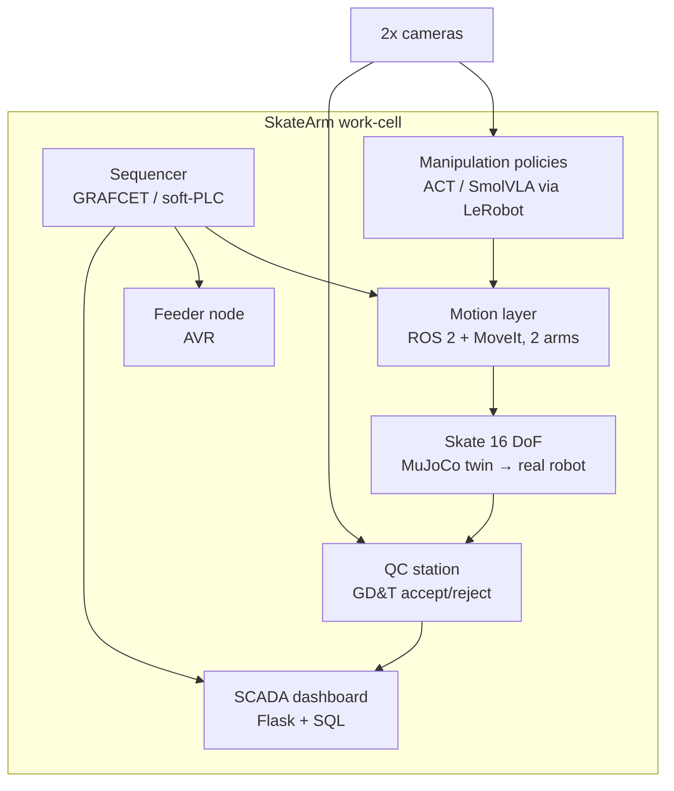

**Demonstrator task:** one arm holds/fixtures a part, the other inserts (peg-in-hole class), then in-cell measurement decides accept/reject and logs to the dashboard. The real Skate (16 DoF, span 1615 mm, RPi 5, UDP control) is en route — Phase 2 starts on arrival; `skate_ros2` is already waiting for it.

Full architecture & mapping of all 12 prior portfolio projects onto subsystems: [docs/ARCHITECTURE.md](docs/ARCHITECTURE.md). Phased plan: [docs/ROADMAP.md](docs/ROADMAP.md).

## Quick start (simulation)

```bash
git clone https://github.com/dsl-robotics/skatearm.git   # this repo (the sim/ tools below live here)
git clone https://github.com/Rbotic/skate_teleop.git     # the official model (skt_v3)
cd skatearm
pip install -r sim/requirements.txt

# one-shot: build the control + collision models in a single step
python sim/make.py --skt-dir path/to/skate_teleop/skt_v3
#   (or  python sim/make.py --clone   — fetches the model and builds it for you)

# …or run the steps individually:
python sim/render_skate.py --model path/to/skate_teleop/skt_v3         # static renders
python sim/make_control_model.py path/to/skate_teleop/skt_v3           # + actuators & sensors
python sim/make_collision_model.py path/to/skate_teleop/skt_v3         # + collision capsules
python sim/demo_wave.py --model path/to/skate_teleop/skt_v3            # control demo (mp4/gif)
python sim/demo_selfcollision.py --model path/to/skate_teleop/skt_v3   # self-collision demo
python sim/telemetry_demo.py --model path/to/skate_teleop/skt_v3       # tracking/torque plot
```

> **Windows:** use `py` instead of `python`/`python3` (the bare names may open the Microsoft Store stub).

Each script is documented in [sim/README.md](sim/README.md). To drive the twin from a browser, follow the [Commander quick start](tools/skate_commander/#quick-start-no-hardware).

## Community tools

Tools get built because SkateArm needs them — then released standalone:

| Tool | What it is | Status |
|---|---|---|
| [`skate_ros2`](tools/skate_ros2/) | ROS 2 bridge over Skate's native UDP + protocol-true MuJoCo sim endpoint | ✅ **shipped** (sim-verified) |
| [`skate_moveit_config`](tools/skate_moveit_config/) | MoveIt 2 config for the bimanual chains — SRDF generated from the URDF, OMPL planning, and a FollowJointTrajectory bridge to the UDP driver | ✅ **built & end-to-end-verified on ROS 2 Jazzy** (colcon + move_group + MoveItPy plans **and executes → sim moves**) |
| [`skate_ros2_control`](tools/skate_ros2_control/) | **ros2_control** hardware interface — a C++ `SystemInterface` bridging `controller_manager` to the driver (inheriting its deadman / e-stop safety) + per-arm `JointTrajectoryController`s whose names match the MoveIt config | ✅ **verified on ROS 2 Jazzy** (JTC goal + a 15-waypoint MoveItPy plan execute **through the controllers**, no Python bridge) |
| [`skate_commander`](tools/skate_commander/) | Web cockpit — browser digital twin with drag-IK, mirror-mode bimanual motion, RRT-Connect collision-routing, an **optional mink IK backend** (`--ik mink`) with proactive self-collision avoidance, **optional rerun.io telemetry** (`--rerun` — a meshed digital twin + scrub-able time-series in a rerun viewer), Python + teach-in programs, **optional LeRobot v3.0 dataset export** (`⤓ LeRobot` — teach-in demos → ACT / Diffusion Policy training data), an application shell, live telemetry and scene/obstacle tools (full list in the [feature catalogue](#skate-commander--web-cockpit) above) · OBSERVE mode — watch a ROS 2 / MoveIt execution live in the twin · sim-validated camera tools parked pending a real depth sensor · [live preview](https://raw.githack.com/dsl-robotics/skatearm/main/tools/skate_commander/preview.html) | ✅ **v0.8.5** (real-camera passthrough waits for hardware) |
| Control-ready MJCF | skt_v3 with actuators, ready for control work | ✅ first version in [sim/](sim/) |
| Teleop dataset hub | Bimanual datasets in LeRobot format | planned |
| [MuJoCo benchmark suite](sim/benchmark.py) | Repeatable bimanual tasks — reach · carry · peg-insert — with quantitative metrics, headless &amp; seeded | ✅ **first version in [sim/](sim/)** |
| URDF/config validator | Sanity-check tool for Skate configs | planned |
| Getting-started handbook | From unboxing to first teleop | planned |

Ideas and requests from other Skate owners are welcome — open an issue.

**Why this project:**
1. **Level up in robotics** — from a single SO-101 arm ([previous project](https://github.com/Lavs-Daniels-Skots-231RMC173/so101-native-ubuntu-ros2-moveit)) to a bimanual humanoid: two-arm coordination, sim-to-real.
2. **Learn by building** — ROS 2, MuJoCo, policy learning (ACT/SmolVLA), classical control, embedded in one system.
3. **Give back to the Skate community** — first-mover window to publish open tools, datasets and guides others can build on.

## Related projects

- **[SO-101 · ROS 2 + MoveIt real-hardware bring-up](https://github.com/Lavs-Daniels-Skots-231RMC173/so101-native-ubuntu-ros2-moveit)** — a real SO-101 / SO-ARM101 arm pair on ROS 2 Jazzy + MoveIt + LeRobot; teleop, dataset record / replay and an ACT policy trained and run online on the physical arm (featured up top).
- **[Engineering Portfolio](https://github.com/Lavs-Daniels-Skots-231RMC173/engineering-portfolio)** — 11 academic & applied projects: industrial robotics, PLC, embedded systems, metrology, CNC, mechanical design.

## Author

**Daniels Skots Lavs** — mechatronics student (RTU), industrial electronics technician.
**open to junior robotics software roles**
[CV (PDF)](docs/Daniels_Skots_Lavs_CV_EN.pdf) · [GitHub profile](https://github.com/Lavs-Daniels-Skots-231RMC173) · [Engineering portfolio](https://github.com/Lavs-Daniels-Skots-231RMC173/engineering-portfolio) · porche121004@gmail.com

## License

MIT — see [LICENSE](LICENSE). The `skt_v3` model and meshes belong to [Rbotic/skate_teleop](https://github.com/Rbotic/skate_teleop) and are **not** redistributed here.
